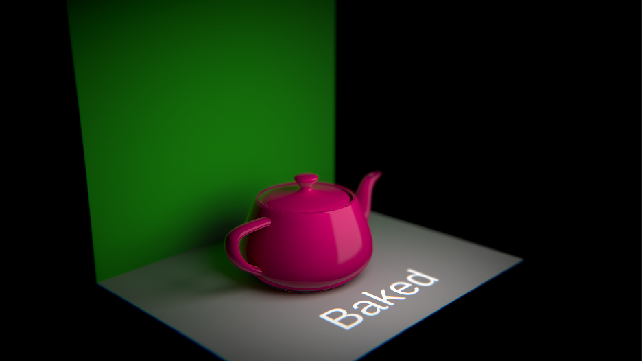

# Unity scene for learn lighting
## Basic to know

### Direct / Indirect Light
Un éclairage direct est un éclairage sans rebond c'est à dire qu'il frappe la surface une seule fois mais ne diffuse pas ensuite.  
Un éclairage indirecte est un éclairage qui utilise les rebonds comme dans la vrai vie - plus il y a de rebond plus la lumière se diffuse dans l'environnement. Au plus elle est proche du premier rebond et au plus elle sera intense dans sa diffusion.

## Précalculé vs Realtime
**Il y a principalement deux manières de lighter une scène:**  
#### Précalculé (Baked)
Soit on précalcule les lights en amont (système de bake). Ce système est le plus opti et le plus qualitatif car il nous permet d'utiliser le raytracing. Il inscrit dans la texture de lumière (lightmap) la valeur de la lumiere et l'occlusion des objets de la scène sous la forme d'un atlas. Le système de précalcule des light offre un grand nombre de paramettre customizable pour avoir un rendu réaliste.  
  
**Inconveniants:**   
- Peut impliquer un temps de calcul plus ou moin long en amont
- Ne permet pas une gestion dynamiques de l'éclairage des objets. Convient pour les objets fixes.
- Ne permet pas d'ombre dynamique
  
  **Avantages:**   
  - L'éclairage est fin et plus réaliste
  - C'est la solution la plus optimisé (elle réduit grandement le nombre de drawcalls)
  
 **Type de Light:**  
1. Area light
2. Directional (en mode baked)
3. Point + spot light (en mode baked)
  
#### Realtime (Enlighten)
Sinon on utilise des lumières dynamique qui permettent de grande variation d'éclairage en temps réel et l'affichage des ombres sur les objets en mouvement. Elle est adaptée pour une lampe qu'on allume ou une lampe torche qui serait tenu par le joueur par exemple.

**Inconveniants:**  
- La qualité des lumière et des ombres est faible
- Ne permet pas d'avoir des rebond lumineux qui sont indispensable à un éclairage réaliste
- Plus il y a d'éclairage dynamique dans la scène plus la scène est gourmande en performance (chaque objets non static qui est touché par une lumière dynamique augmntent le nombre de drawcall)
  
  **Avantages:**  
  - Projection des ombres
  - On peut faire varié instantanément l'intensité, la porté ou la couleur de l'éclairage en temps réel.
  
 **Type de Light:**  
 1. Directional (en mode realtime)
 2. Point + spot light (en mode realtime)
  
#### Le mode mixed
En fait, la bonne manière de faire son lighting est d'intégrer un mélange des deux solutions et de choisir pour chaque objet un traittement lumineux adapté et lui associé le bon type de lumière.
  Grâce au mode mixed c'est possible de mélanger précalcule et lumière dynamique et de jongler entre les inconveniant de l'un et de l'autres des solutions.

# Sample
## Environment lighting

Scène d'exemple avec un lighting réaliste par la diffusion de l'environnement (**HDRI**) [site avec des HDRI gratuites ](https://polyhaven.com/hdris).`

## Realtime Emissive

  
## Full baked arealight

Scène d'exemple avec un lighting réaliste qui utilise une arealight
## Tips

- Si vous voulez un éclairage réaliste respectez les échelles des éléments
- Les postprocess sont indispensable pour complémenter l'éclairage - ils viennent sur la base du lighting fini et sont indispensable pour peaufiner le rendu
